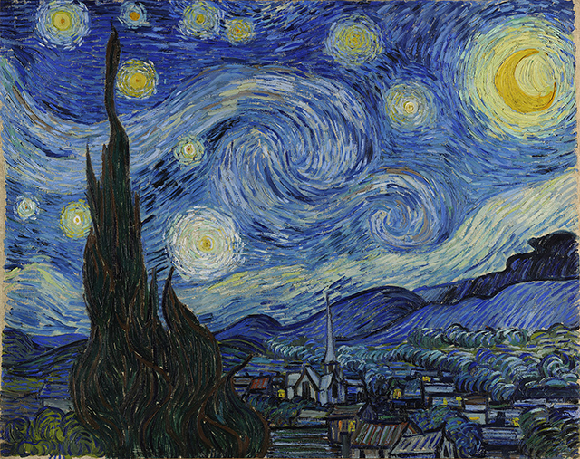

# Neural-Style-TZ

Last modified @ 2019/11/23

## contributor
tuzhuo @ croplab, HZAU

## GPU comparison

**VERY LITTLE CPU** time was used when you have a GPU.

### operating environment 1
1. Intel(R) Xeon(R) Gold 6140 CPU @ 2.30GHz * 4 (72 cores)
2. **GeForce RTX 2070 * 2** (2 gpu memory were used, but only 1 gpu was calculating)
3. 128 GB RAM
4. tensorflow-gpu, NumPy, SciPy, Pillow, CUDA, imagenet-vgg-verydeep-19.mat
5. for a 1200 * 950 pixel image, with the environment above, it only takes **12 min 5 sec** for 1000 iterations.
6.  Using a **GPU** is highly recommended due to the huge speedup.

### operating environment 2
1. Intel(R) Xeon(R) Gold 6140 CPU @ 2.30GHz * 2 (36 cores)
2. **Tesla P100-PCIE-16GB * 2** (2 gpu memory were used, but only 1 gpu was calculating)
3. 512 GB RAM
4. tensorflow-gpu, NumPy, SciPy, Pillow, CUDA, imagenet-vgg-verydeep-19.mat
5. for a 1200 * 950 pixel image, with the environment above, it only takes **5 min 22 sec** for 1000 iterations.
6.  Using a **POWERFUL GPU** is highly recommended due to the huge speedup.

### operating environment 3
1. Intel(R) Xeon(R) CPU E5-2640 v4 @ 2.40GHz * 4 (40 cores)
2. **Tesla V100-SXM2-16GB * 4** (4 gpu memory were used, but only 1 gpu was calculating)
3. 128 GB RAM
4. tensorflow-gpu, NumPy, SciPy, Pillow, CUDA, imagenet-vgg-verydeep-19.mat
5. for a 1200 * 950 pixel image, with the environment above, it only takes **2 min 15 sec** for 1000 iterations. 
6. Using a **TOP-LEVEL GPU** would largely reduce time cost.

## performance:

### source image

### style transfer 1

### style transfer 2

### style transfer 3

### style transfer 4

### style transfer 5

### style transfer 6

## Appendix
[source project](https://github.com/anishathalye/neural-style)
